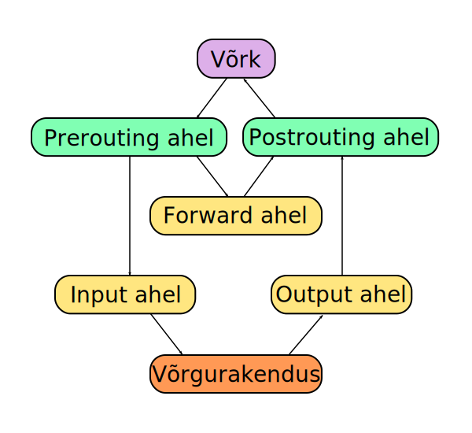

.. author: Lauri Võsandi <lauri.vosandi@gmail.com>
.. license: cc-by-3
.. tags:  iptables
.. date: 2013-10-31

iptables
========

Visuaalselt ning lihtsustatult on *netfilter* ehk Linux-i tulemüür üles ehitatud ahelatest [#packet-flow]_:

Võrgust arvuti suvalisele võrguliidesele saabunud pakett läbib
marsruutimiseelse (*prerouting*) ahela,
kus on võimalik teha DNAT-i (*Destination* *Network* *Address* *Translation*),
modifitseerimaks näiteks sihtaadressi või sihtporti.
Järgnevalt kontrollib tuum (*kernel*), kas pakett kuulub edastamisele või
on pakett addresseeritud mõnele kohalikule rakendusele.

Edastamisele kuuluvate pakettide puhul kontrollitakse kas pakett
klapib mõne *forward* ahela reegliga, kui see tõesti nii on, siis saadetakse
pakett edasi *postrouting* ahelasse. *Postrouting* ahelas
saab teha *SNAT*-i (*Source*/*Secure* *Network* *Address* *Translation*),
selleks et näiteks välja mineva paketi lähteaadressi modifitseerida.
Kõige lihtsam näide *SNAT*-ist on maskeraad (*Masquerade*),
kus väljuva IP-paketi lähte IP-aadressiks saab masina võrguliidese IP-aadress.

Sisse tulnud ning *prerouting* ahela läbinud paketid mis kuuluvad vastu võtmisele
läbivad *input* ahela, kus saab näiteks piirata ligipääsu kohalikult käitatavatele
serverirakendusele.

Igas ahelas on mitu kolmest järgnevast tabelist mis käitakse läbi ülevalt-alla ükshaaval:

* *mangle* - Pakettide modifitseerimiseks
* *nat* - Pakettide marsruutimiseks
* *filter* - Pakettide filtreerimiseks

Kasutaja saab *netfilter*-i olekut manipuleerida *iptables* käsu abil.
Ubuntu vaikimisi tulemüürireeglid on võrdlemisi liberaalsed:

.. code::

    localhost ~ # iptables -L
    Chain INPUT (policy ACCEPT)
    target     prot opt source               destination         

    Chain FORWARD (policy ACCEPT)
    target     prot opt source               destination         

    Chain OUTPUT (policy ACCEPT)
    target     prot opt source               destination 

Kuidas interpreteerida selle käsu väljundit?
Kuna pole täpsustatud mis tabeli kirjeid me soovime näha, siis vaikimisi näidatakse
*filter* tabeleid. Need tabelid eksisteerivad vaid
*input*, *forward* ning *output* ahelates.

Täpsustades tabeli saame ka erineva väljundi:

.. code::

    localnhost ~ # iptables -t nat -L 
    Chain PREROUTING (policy ACCEPT)
    target     prot opt source               destination         

    Chain INPUT (policy ACCEPT)
    target     prot opt source               destination         

    Chain OUTPUT (policy ACCEPT)
    target     prot opt source               destination         

    Chain POSTROUTING (policy ACCEPT)
    target     prot opt source               destination  

Tihtipeale on *iptables* reeglid hallatud mõne tulemüüri tööriista poolt,
nt *Firestarter*.

.. [#packet-flow] `Packet flow <http://blog.schaal-24.de/wp-content/uploads/2013/08/2683-PacketFlow.png>`_

