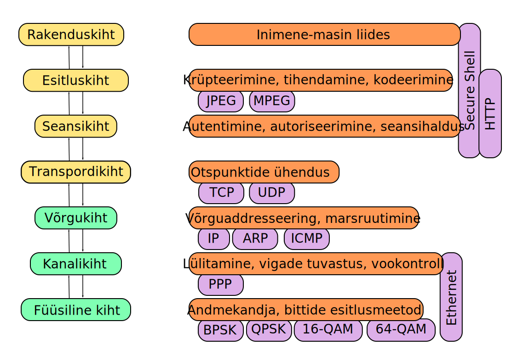

.. title: Võrguteenused
.. author: Lauri Võsandi <lauri.vosandi@gmail.com>
.. tags: 
.. date: 2013-10-31

Võrguteenused
=============

Selleks et tulemüüri seadistamine õige libedalt läheks, tuleb kõigepealt
selgeks teha mis kihtidel üks või teine võrguteenus opereerib.
Kõige värvikamalt kirjeldab seda *avatud* *süsteemide* *sidumise* *arhitektuur* ehk
OSI mudel:

OSI mudelis eristatakse erinevaid addresseerimismeetodeid:

* Füüsiline kiht defineerib masinate vahelised füüsilised ühendused (valguskaabel, võrgukaabel, WiFi)
* Kanalikiht defineerib arvuti füüsilise aadressi MAC-aadressi abil (01:23:45:67:89:10)
* Võrgukiht defineerib arvuti loogilise aadressi IP-aadress abil (12.34.56.78)
* Transpordikiht defineerib teenuse aadressi arvutis pordinumbri abil (12.34.56.78:1234)

Transpordikihis eristatakse peamiselt kahte kapseldusprotokolli:

* TCP (*Transport* *Control* *Protocol*) ehk edastusohje protokoll garanteerib
  IP-pakettide kokkupaneku õiges järjekorras sooritades seejuures
  elementaarse veatuvastuse kasutades CRC algoritmi. TCP-d kasutatakse
  tavaliselt kahesuunalise voo (*stream*) kapselamiseks: SSH, HTTP, HTTPS
* UDP (*User* *Datagram* *Protocol*) ehk kasutajadatagrammi protokoll
  on olekuta IP-pakettide kapseldusprotokoll. UDP-d kasutatakse veatolerantsetes
  rakendustes, nt heli/video üle kandmiseks: DNS, DHCP, Skype

Port on number vahemikus 0-65535.
Privilegeeritud teenusteks (*privileged* *ports*) nimetatakse
teenuseid mida käitatakse 1024 või madalamal pordil. Privilegeeritud teenuseid
saab tavaliselt käivitada vaid selle arvuti juurkasutaja (*root*).
Väljuvate TCP/UDP ühenduste lähtepordiks on tavaliselt port 49152 või kõrgem ning see
on suvaliselt valitud operatsioonisüsteemi poolt.
Portidel 1025 kuni 49151 võib luua kuulava sokli (*listening* *socket*) tavakasutaja.

Linux tulemüür opereerib peamiselt kanalikihil, võrgukihil, transpordikihil, mis
tähendab, et *iptables* reegli saab panna vastavusse ühe või mitmega järgmisest:

* Mis võrguliideselt pakett tuleb?
* Mis MAC-aadressilt pakett tuleb?
* Mis IP-aadressilt pakett tuleb?
* Mis IP-aadressile pakett läheb?
* Mis pordile pakett läheb?
* Kas tegu on UDP või TCP paketiga?

Täiendavate moodulitega saab manipuleerida ka muid omadusi:

* Mis olekus TCP ühendus on?
* Mis kellaajal pakett liigub?
* Mis riigist pakett tuleb?
* Mis kasutajalt pakett välja läheb?
* Mis kõrgema taseme protokolli (HTTP, BitTorrent, vms) kooseisu pakett kuulub?

Samas on mitmeid kasutusjuhte, mille lahendamiseks *netfilter*/*iptables* **EI** sobi:

* Mis masinanimelt (*hostname*) pakett tuleb?
* Mis domeeninimele on HTTP päring suunatud?

Paljud võrgurakendused kasutavad TCP vahekihti (*TCP* *wrapper*), millega saab 
blokeerida ning lubada ligipääsu rakendusele IP-aadressi või
masinanime (*hostname*) järgi. Ubuntus on vastavad failid
*/etc/hosts.allow* ning */etc/hosts.deny*.
Kõrgema taseme protokollide turvamisel tuleb sukelduda seda protokolli serveeriva
rakenduse spetsiifikasse:

* Apache puhul timmida virtuaalserverite (*virtual* *host*) ning
  teede (*path*) järgi filtreerimist; 
  ligipääsupiirangud (*htaccess*)
* OpenSSH puhul piirata sisselogimisõigustega kasutajate nimekirja;
  vahetada parooliga sisselogimine võtmega sisselogimise vastu;
  kasutada vingemaid sihvreid; kasutada *denyhosts* rakendust
  korjamaks kokku ebaõnnestunud sisselogimised ning blokeerida IP-aadressid
  kust need pärinevad

Rusikareegel on see, et rakendus mis ei pea olema suvaliselt IP-aadressilt 
nähtav, tuleks sealt ka ära peita.

Järgnevalt on välja toodud mõned kõige olulisemad võrguteenused:

* Telnet - TCP 23
* SSH - TCP port 22
* SMTP - TCP port 25
* HTTP - TCP pordil 80
* NTP - UDP port 123
* HTTPS - TCP port 443
* Samba - TCP port 445, TCP/UDP pordid 138 ja 139
* DNS - UDP port 53
* TFTP - UDP port 69
* NFS - Kasutab mitmeid porte läbi Portmap teenuse
* IMAP - TCP port 143
* IMAP over SSL - TCP port 993
